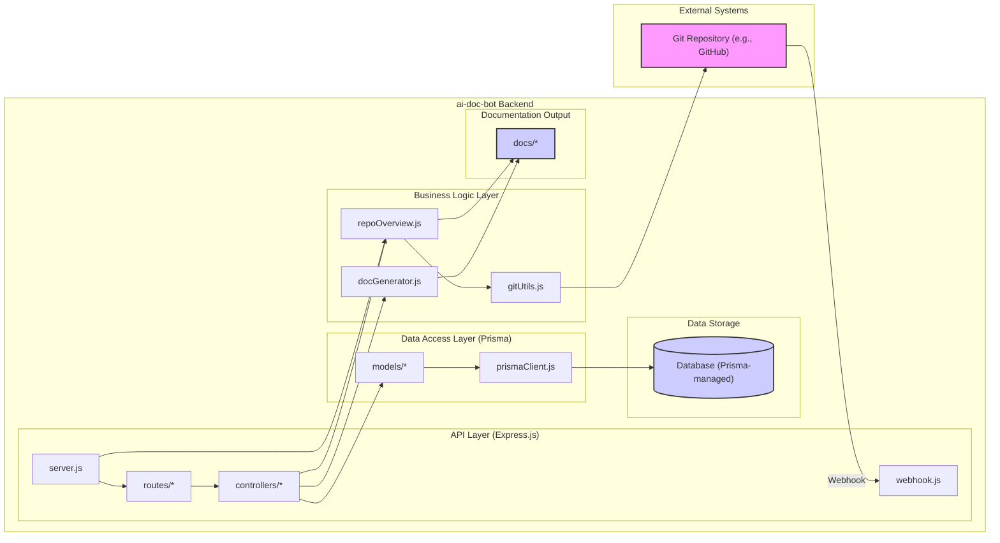

# Architecture Diagram

```mermaid
graph LR
    subgraph "External Systems"
    GitRepository["Git Repository (e.g., GitHub)"]
    end
    subgraph "ai-doc-bot Backend"
    subgraph "API Layer (Express.js)"
        server[server.js] --> routes["routes/*"]
        routes --> controllers["controllers/*"]
        webhook[webhook.js]
        GitRepository -- Webhook --> webhook
    end
    subgraph "Business Logic Layer"
        controllers --> docGenerator[docGenerator.js]
        controllers --> repoOverview[repoOverview.js]
        repoOverview --> gitUtils[gitUtils.js]
    end
    subgraph "Data Access Layer (Prisma)"
        prismaClient[prismaClient.js]
        models["models/*"]
    end
    subgraph "Data Storage"
        Database[("Database (Prisma-managed)")]
    end
    subgraph "Documentation Output"
        Documentation["docs/*"]
    end
    end
    
    server --> repoOverview
    controllers --> models
    models --> prismaClient
    prismaClient --> Database
    docGenerator --> Documentation
    repoOverview --> Documentation
    gitUtils --> GitRepository
    
    style GitRepository fill:#f9f,stroke:#333,stroke-width:2px
    style Database fill:#ccf,stroke:#333,stroke-width:2px
    style Documentation fill:#ccf,stroke:#333,stroke-width:2px
```
